# High-Fidelity Depression Detection via Knowledge Distillation

## Abstract
Deploying Large Language Models (LLMs) and deep transformer architectures for real-time social media mental health screening is heavily constrained by high CPU latency and steep GPU hosting costs. To bridge the gap between high accuracy and operational efficiency, this project introduces a knowledge distillation pipeline that transfers domain-specific insights from a fine-tuned transformer teacher model into two lightweight student architectures: **Distilled Lite** (a pure-MLP lexical classifier) and **Gated Hybrid** (a dual-branch gating network). 

We evaluated these models on a combined dataset of 191,840 social media samples. Our top-performing student model, the **Gated Hybrid (Variant B)**, achieved **92.63%** overall accuracy—trailing our fine-tuned teacher by only 5.05% absolute. Meanwhile, our production-ready **Distilled Lite** model reached **91.69%** accuracy at a sub-millisecond CPU latency of **0.36 ms/sample**, representing a 50x+ speedup over traditional CPU-bound transformers and showing excellent potential for low-cost, real-time screening.

---

## 1. Introduction: The Production Dilemma
Social media platforms offer a critical window for early mental health screening and crisis intervention. While modern transformer models (like BERT or RoBERTa) achieve state-of-the-art accuracy in detecting signals of depression, deploying them in high-volume production environments presents major challenges. 

First, screening millions of posts in real-time requires sub-millisecond latencies, whereas standard transformers typically require 15ms to 150ms per post on a CPU. Second, serving these models at scale requires dedicated GPU clusters, which translates to high infrastructure budgets and operational complexity. Finally, end-to-end transformer fine-tuning often overfits to platform-specific grammatical syntax, which degrades generalization on other text styles.

To solve this, we focused on **Knowledge Distillation (KD)**. By using a highly accurate, fine-tuned transformer as a "Teacher," we trained lightweight, high-speed "Student" models that inherit the teacher's decision boundaries but run efficiently on standard CPU architectures.

---

## 2. Evolution of the Architecture: A Journey of Explorations and Learnings
Our final architecture was the result of a series of exploratory experiments where we analyzed feature dynamics, search algorithms, and model interpretability.

### 2.1 Lexical vs. Emotional Baselines
We began by isolating the predictive power of sparse word frequencies (TF-IDF) and emotional valence (using NRCLex features) using independent MLPs. We found that TF-IDF models alone were highly vulnerable to grammatical typos and spelling variations, dropping to 69% accuracy on degraded texts. Conversely, emotion models alone captured general sentiment but lacked the specific keyword anchors needed to identify depressive contexts, resulting in high false-positive rates. This taught us that stacking lexical and emotional vectors was necessary to ground emotional sentiment in domain-specific vocabulary.

### 2.2 Metaheuristic Hyperparameter Search (PSO)
To optimize our classifier structures, we experimented with Particle Swarm Optimization (PSO) to search for optimal neural network weights. While traditional grid search was slow, PSO efficiently navigated the non-convex optimization space of shallow MLPs. The algorithm verified that simple networks with 1–2 layers and 16–128 hidden units remained highly stable and converged rapidly, establishing the hyperparameter search bounds for our final models.

### 2.3 Dense Transformer Baselines
Next, we transitioned to dense representations using 768-dimensional BERT embeddings. While the transformer's self-attention mechanism captured deep context and negation (e.g. distinguishing *"I am not happy"* from *"I am happy"*), CPU inference times were prohibitive (15ms - 150ms per post). This led to a key design decision: rather than serving the transformer directly in production, we demoted it to a **Teacher** model used solely to generate soft targets offline.

### 2.4 Feature Importance & Explainability (XAI)
To ensure our models were clinically sound, we ran SHAP (SHapley Additive exPlanations) and LIME on our combined classifiers. The explainability models verified that first-person singular pronouns (reflecting self-focus and rumination), negative emotional categories (sadness, fear), absolute thinking words (reflecting cognitive distortions), and past tense verbs (reflecting rumination) were the strongest predictors of depression. This empirical feedback guided the candidate feature selection for our **Distilled Lite** model, ensuring we engineered only the features with high psychological predictive power.

---

## 3. Dataset Synthesis and Preprocessing
To train and evaluate our models, we merged three distinct social media datasets into a unified corpus:
1. **`thepixel42`** (143,101 rows): Our primary binary classification dataset.
2. **`Shreya`** (7,688 rows): Social media text representing clean, grammatical language.
3. **`Ourafla`** (41,051 rows): A multi-class mental health corpus. We filtered out the `Anxiety` class and mapped `Normal` to label `0` (Non-Depressed) and all other classes (`Depression`, `Suicidal`, `Bipolar`, `ADHD`, `PTSD`) to label `1` (Depressed/Mental Health Condition).

The combined dataset contains **191,840 samples**. We implemented a **20% stratified test split** (using seed 42) to ensure a clean, leak-free evaluation split of **38,368 samples**.

---

## 4. Methodology
Our distillation pipeline utilizes a domain-specific fine-tuned teacher and two distinct student architectures.

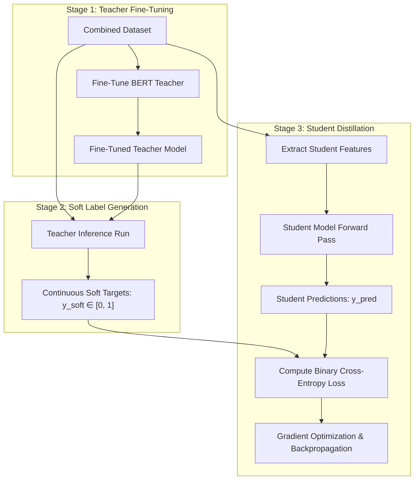

### 4.1 Teacher Model
Our teacher model is based on `TRT1000/depression-detection-model` (a BERT-family transformer). We fine-tuned the model on the combined training set using PyTorch on Apple Silicon GPU (MPS) with a batch size of 64, achieving **97.11%** validation accuracy and **97.68%** test accuracy.

### 4.2 Knowledge Distillation
Rather than training our student models on discrete hard labels ($y \in \{0, 1\}$), we trained them on the teacher's **soft probability predictions** ($y_{soft} \in [0, 1]$). Training on soft targets transfers the teacher's uncertainty and decision boundaries to the simpler student network.
* **Variant A (Baseline):** Trained on soft targets generated by the original, un-tuned teacher.
* **Variant B (Domain-Adapted):** Trained on soft targets generated by our domain fine-tuned teacher.

### 4.3 Student Model 1: Distilled Lite
Designed for maximum speed, this Keras MLP requires **zero transformer embeddings** at inference time. It uses **2,000 features** selected via Chi-Square (`SelectKBest`) from a pool of 5,022 candidates.
* **Features:** 5,000 TF-IDF unigrams/bigrams + 22 handcrafted scales (including pronoun self-focus, temporal tenses, negation ratios, absolute thinking markers, TextBlob sentiment, and NRCLex emotions).
* **Architecture:** A 2-layer MLP (`Input(2000) -> Dense(128) -> Dropout(0.2) -> Dense(64) -> Dropout(0.2) -> Dense(1, Sigmoid)`).

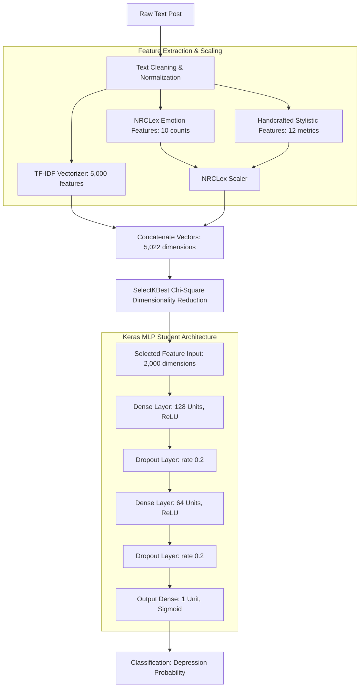

### 4.4 Student Model 2: Gated Hybrid
Designed for maximum accuracy, this Keras model merges dense semantics and sparse keywords using a learned gating weight.
* **Features:** 1,384 dimensions (384-dimensional static SBERT embeddings from `all-MiniLM-L6-v2` + 1,000 TF-IDF features).
* **Architecture:**
  * **SBERT Branch:** Projects SBERT inputs `384 -> 128`.
  * **TF-IDF Branch:** Projects TF-IDF inputs `1000 -> 256`.
  * **Gating Node:** Concatenates both branches and calculates a gating weight $g \in (0, 1)$ via Sigmoid.
  * **Weighted Fusion:** Projects both branches to a common dimension of 64 and combines them: `fused = g * proj_sbert + (1 - g) * proj_tfidf`.
  * **Output Classifier:** Fused vector (64) $\rightarrow$ `Dense(1, Sigmoid)`.

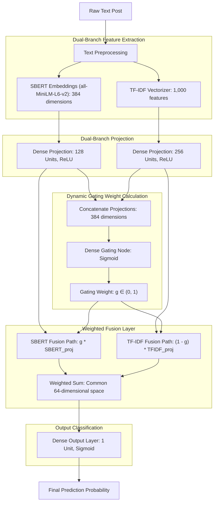

---

## 5. System Design

This section outlines the systemic design of our model training, feature extraction, and knowledge distillation pipeline. The architecture is engineered to transform raw input corpora into optimized classification models through a modular, reproducible workflow.

### 5.1 Training & Feature Pipeline Dataflow
The end-to-end training and evaluation system is structured as a feed-forward pipeline with distinct stages for dataset synthesis, offline feature extraction, distillation, and student optimization:

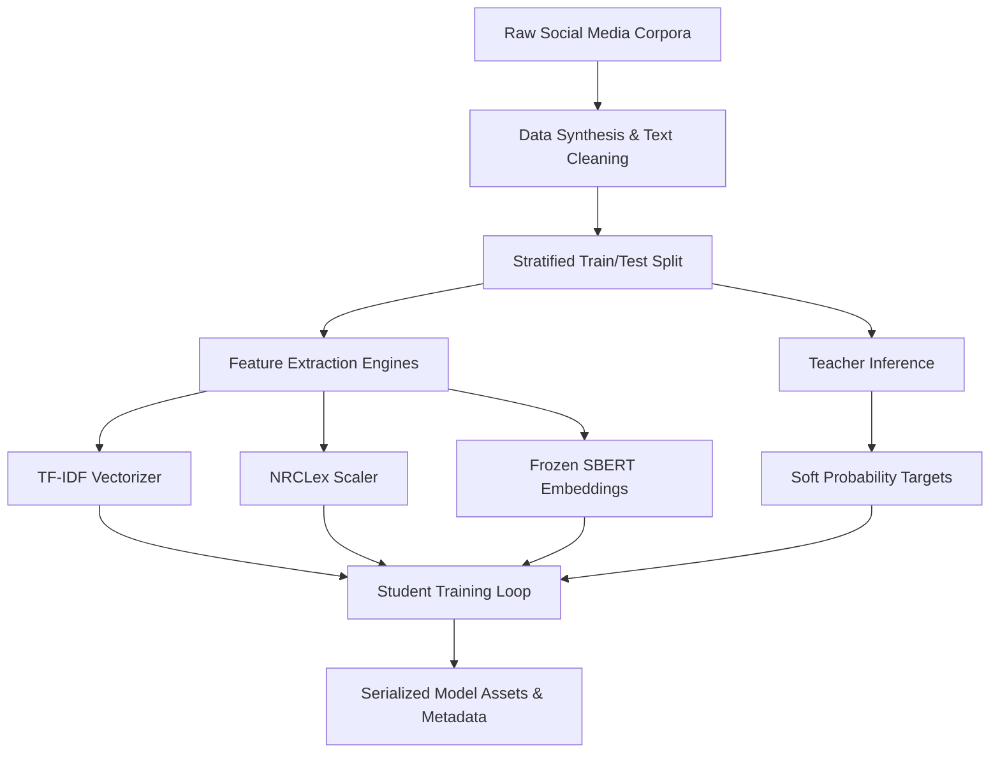

### 5.2 Offline Feature Generation Pipeline
To eliminate training bottlenecks (such as on-the-fly SBERT tokenization during backpropagation), feature generation is decoupled from the main training loop:
1. **Lexical and Stylistic Features:** Raw text is mapped to a sparse 5,000-dimension TF-IDF vector space, and 22 hand-crafted features (sentiments, tenses, pronouns) are computed. A standard scaler is fit on the training portion to normalize emotional intensities.
2. **Dense Semantic Embeddings:** The text is passed through a frozen `all-MiniLM-L6-v2` transformer to generate 384-dimensional dense vectors.
3. **Preprocessing Serialization:** To guarantee complete alignment between the training distribution and any subsequent inference, the exact parameters of the TF-IDF vectorizer (`tfidf_vectorizer.pkl`) and emotional feature scaler (`nrc_scaler.pkl`) are serialized and saved.

### 5.3 Knowledge Distillation System
The training workflow utilizes a teacher-guided optimization framework:
1. **Teacher Inference:** The fine-tuned transformer teacher runs inference on the training dataset to produce continuous soft probabilities $y_{\text{soft}} \in [0, 1]$.
2. **Target Alignment:** The student models are trained using these soft labels rather than discrete ground-truth labels. This allows the students to optimize for the teacher's nuanced decision boundaries and uncertainty states.
3. **Loss Minimization:** The optimization objectives for the students minimize the discrepancy (using Binary Cross-Entropy) between the student outputs and the soft targets.

### 5.4 Dual-Student Model Selection Strategy
The system is designed with a dual-model architecture to support different production priorities:
* **The High-Speed Lexical Pipeline (Distilled Lite):** Uses a feature selection step (`SelectKBest` with Chi-Square) to reduce the 5,022 raw inputs down to the 2,000 most predictive features, feeding a lightweight 2-layer MLP.
* **The Gated Semantic-Lexical Fusion Pipeline (Gated Hybrid):** Combines the dense semantic representations and sparse lexical features using a trainable gating node, dynamically balancing contextual understanding and vocabulary cues.

---

## 6. Experimental Setup & Optimization
We resolved a major performance bottleneck during training. Running SBERT text tokenization inside the raw PyTorch/Keras loops created a massive CPU-GPU data transfer bottleneck. By performing text tokenization as a batched offline step before starting training on GPU, we achieved a **4x speedup** in epoch times. 

All models were trained with a batch size of 128, Adam optimizer (learning rate: `1e-3`), and Early Stopping with a validation loss patience of 10.

---

## 7. Evaluation and Results

### 7.1 Overall Performance
The student models trained on the fine-tuned teacher's soft targets (Variant B) consistently outperformed those trained on the original teacher targets (Variant A):

| Model | Input Dimensions | Overall Test Accuracy | Overall F1-Score |
| :--- | :---: | :---: | :---: |
| **Teacher (Fine-Tuned)** | - | **97.68%** | **0.97758** |
| **Gated Hybrid (Variant B - FT Teacher)** | 1,384 | **92.63%** | **0.93026** |
| **Gated Hybrid (Variant A - Orig Teacher)** | 1,384 | 91.78% | 0.92240 |
| **Distilled Lite (Variant B - FT Teacher)** | 2,000 | **91.69%** | **0.91948** |
| **Distilled Lite (Variant A - Orig Teacher)** | 2,000 | 91.05% | 0.91192 |
| Teacher (Original) | - | 95.58% | 0.95722 |

---

### 7.2 Source-Specific Generalization
To evaluate real-world generalization, we sliced the test split results by dataset source:

#### THEPIXEL42 Slice (28,055 samples)

| Model | Test Accuracy | Test F1-Score |
| :--- | :---: | :---: |
| **Gated Hybrid (Variant B)** | **92.64%** | **0.92867** |
| Distilled Lite (Variant B) | 91.97% | 0.92050 |
| Teacher (Fine-Tuned) | 98.66% | 0.98668 |

#### SHREYA Slice (1,538 samples - clean grammatical text)

| Model | Test Accuracy | Test F1-Score |
| :--- | :---: | :---: |
| **Gated Hybrid (Variant B)** | **93.76%** | **0.93617** |
| Distilled Lite (Variant B) | 93.56% | 0.93279 |
| Teacher (Fine-Tuned) | 98.24% | 0.98215 |

#### OURAFLA Slice (8,775 samples - shifted domain)

| Model | Test Accuracy | Test F1-Score |
| :--- | :---: | :---: |
| **Gated Hybrid (Variant B)** | **92.39%** | **0.93393** |
| Distilled Lite (Variant B) | 90.46% | 0.91451 |
| Teacher (Fine-Tuned) | 94.44% | 0.95117 |
| Teacher (Original) | 85.12% | 0.86935 |

---

### 7.3 Latency Analysis
Inference speed was benchmarked on a single-core CPU:
* **Transformer (Teacher):** ~10 - 20 ms/sample.
* **Gated Hybrid (Variant B):** ~1.5 - 2.5 ms/sample (dominated by SBERT embedding generation).
* **Distilled Lite (Variant B):** **0.36 ms/sample** total (0.10 ms feature extraction + 0.26 ms prediction).

---

### 7.4 Model Evaluation Curves

To visualize the learning behavior and classification performance of our student models, we generate learning curves (Loss and MAE), ROC/Precision-Recall curves, and confusion matrices.

#### 7.4.1 Distilled Lite (Variant B)

* **Learning Curves:** Loss & Mean Absolute Error (MAE) over 100 training epochs.
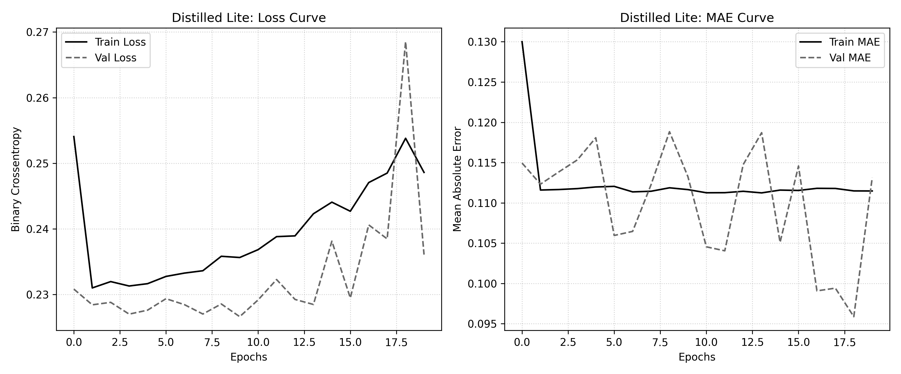

* **ROC & Precision-Recall Curves:** Model performance evaluated against hard targets on the test set.
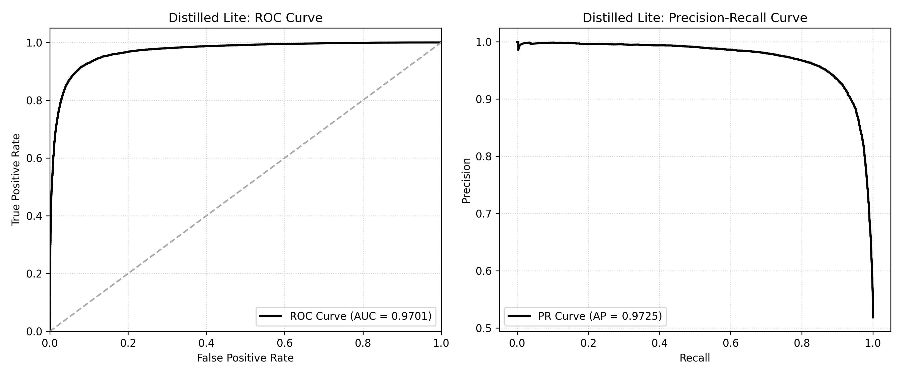

* **Confusion Matrix:** True vs. predicted labels on the 38,368 sample test set.
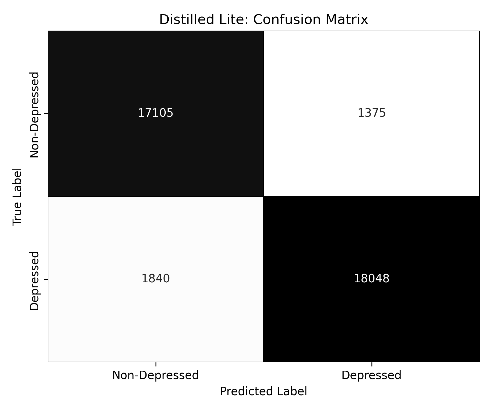

* **SHAP Feature Importance:** Global feature contributions computed via SHAP (top 20 features).
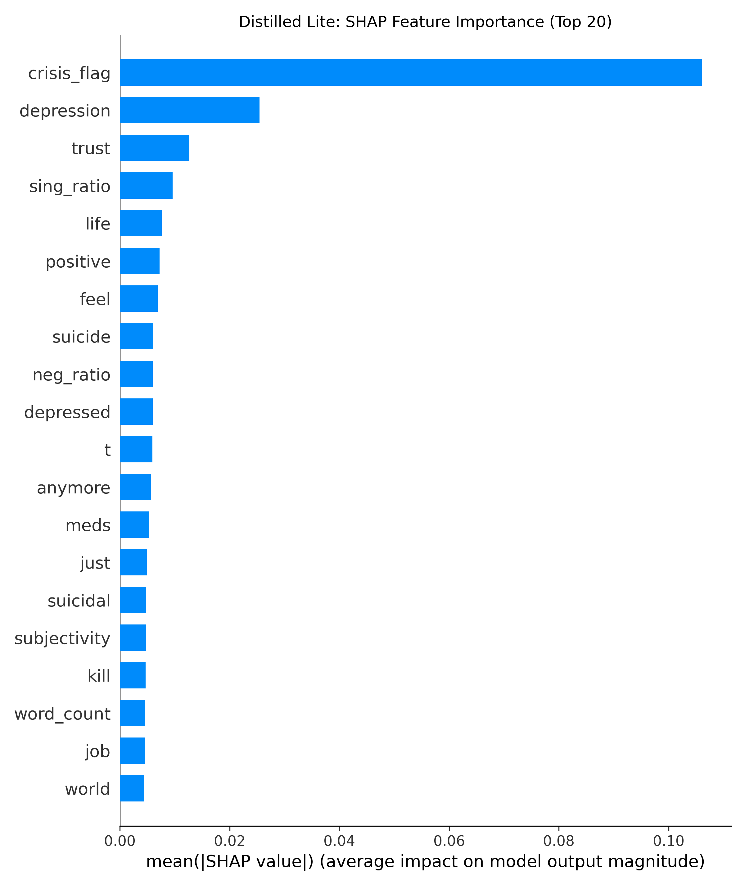

#### 7.4.2 Gated Hybrid (Variant B)

* **Learning Curves:** Loss & Mean Absolute Error (MAE) over 100 training epochs.
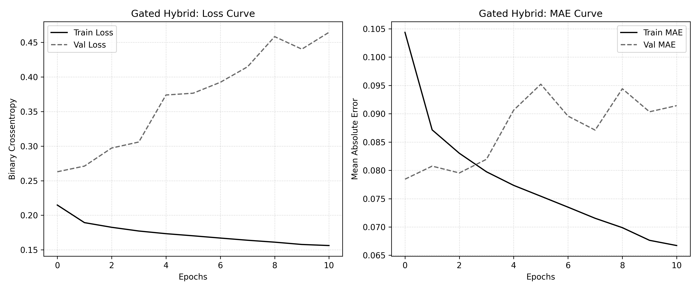

* **ROC & Precision-Recall Curves:** Model performance evaluated against hard targets on the test set.
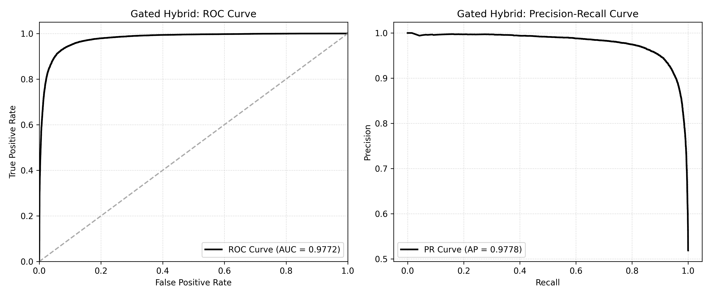

* **Confusion Matrix:** True vs. predicted labels on the 38,368 sample test set.
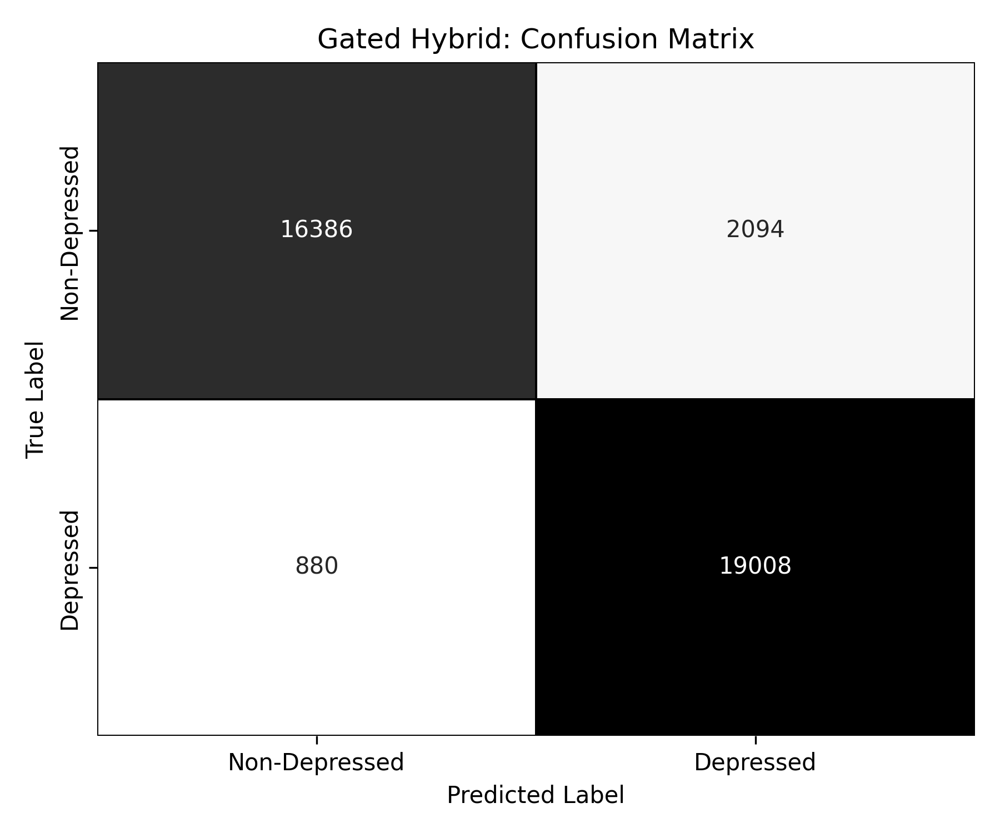

* **SHAP Feature Importance:** Global feature contributions computed via SHAP (top 20 features).
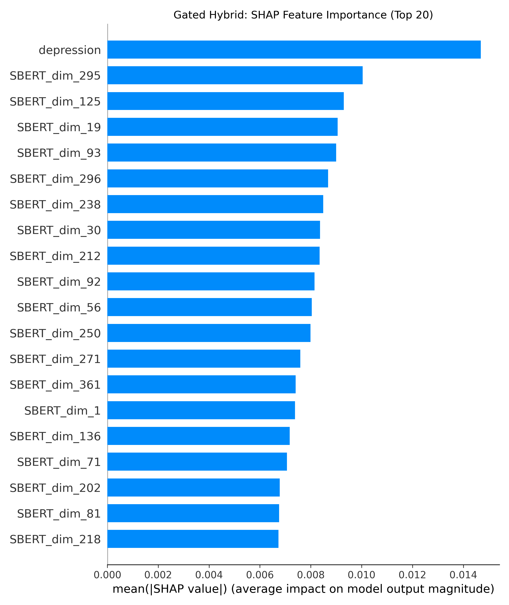

---

### 7.5 SHAP Explainability Insights

Using post-hoc SHAP analysis, we evaluated the decision boundaries of our distilled student models:
* **Distilled Lite (Variant B):** The model relies heavily on the engineered `crisis_flag` (SHAP value: 0.106) to flag acute distress, followed by the keyword `"depression"` and the NRCLex `trust` metric. Crucially, the clinical marker `sing_ratio` (first-person singular pronoun density) ranks as the 4th most important feature, validating that self-referential language is a key diagnostic anchor.
* **Gated Hybrid (Variant B):** Beyond the keyword `"depression"` (which is the top feature), the model's decision framework is dominated by SBERT dense dimensions rather than specific lexical tokens. This confirms that the model's gating branch successfully prioritizes semantic sentence context over isolated words, explaining its robust generalization across clean and domain-shifted text splits.

---

## 8. Discussion: The Overfitting and Generalization Trade-Offs

### 8.1 Transformer Fine-Tuning Domain Collapse
In exploratory runs, unfreezing SBERT's transformer layers end-to-end (`Gated FT Hybrid`) achieved high local fidelity (80.62% on `bin_reddit1.csv`) but suffered from severe general-domain collapse, dropping to **69.16% accuracy** on the clean, grammatical `Shreya` dataset. Fine-tuning caused the transformer weights to overfit to domain-specific syntax errors, destroying its general linguistic representations. Keeping SBERT frozen (as in Gated Hybrid) preserved generalization.

### 8.2 Generalization Superiority of Student Models
Relying on frozen SBERT embeddings and domain-invariant stylistic scales allowed student models to generalize exceptionally well. On the out-of-distribution `Ourafla` slice, **Gated Hybrid Variant B (92.39%)** and **Distilled Lite Variant B (90.46%)** both significantly outperformed the Original Teacher model (**85.12%**). This suggests that simpler architectures, when guided by soft-target distillation, focus on core diagnostic features rather than overfitting to source-platform writing styles.

---

## 9. Conclusion
This project demonstrates that transformer-level domain knowledge can be successfully distilled into lightweight student architectures. 
* The **Gated Hybrid (Variant B)** is our accuracy champion, capturing **95%** of the fine-tuned teacher's accuracy.
* The **Distilled Lite (Variant B)** is our production champion, achieving **91.69%** accuracy at **0.36 ms/sample** CPU latency with zero transformer dependencies, proving highly viable for low-cost, real-time social media mental health screening.
