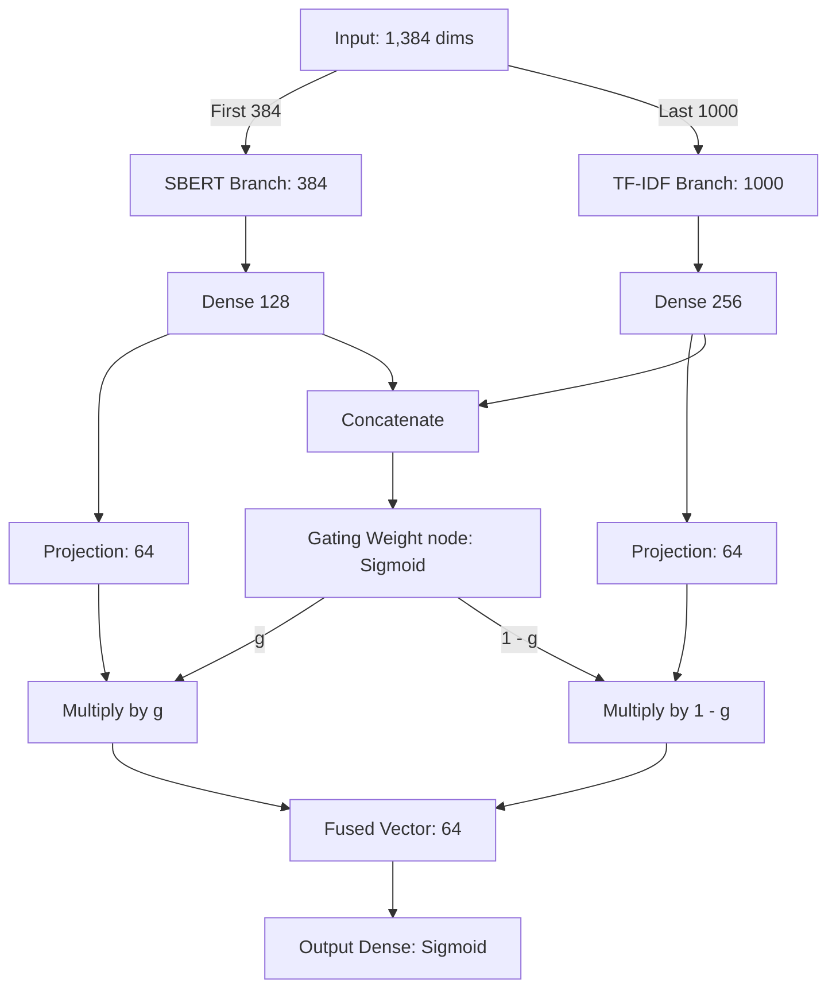

# Gated Hybrid Student Model

The **Gated Hybrid** student model is a dual-branch neural network utilizing a **Gated Fusion Architecture**. It is designed to combine dense semantic context and sparse lexical keywords dynamically.

This approach addresses the issue of "feature mismatch" on grammatically degraded or lemmatized text (where pre-trained sentence encoders like SBERT can drop in performance due to out-of-distribution syntax shifts) by using a learned gating node to weight keyword indicators against semantic embeddings.

---

## 1. Feature Representation
The input features total **1,384 dimensions** and are horizontally concatenated:
1. **Dense SBERT Embeddings (384 dimensions):** Semantic context extracted using `all-MiniLM-L6-v2`.
2. **Sparse TF-IDF Keywords (1,000 dimensions):** High-frequency unigrams/bigrams capturing specific vocabulary.

---

## 2. Gated Fusion Architecture
The network processes both feature types in parallel, dynamically combining them:

* **Optimizer:** Adam (Learning Rate: `1e-3`)
* **Loss:** Binary Crossentropy

---

## 3. Dataset Configurations & Training Methods
* **Baseline Pipeline:** Trained on [bin_reddit1.csv](file:///Users/dark/code/project/depression/datasets/bin_reddit1.csv) using **Blended Targets** ($\alpha = 0.1$):
  $$y_{blend} = 0.1 \cdot y_{true} + 0.9 \cdot y_{teacher}$$
  *Features extracted via:* [generate_hybrid_features.py](file:///Users/dark/code/project/depression/src/distilled_hybrid/generate_hybrid_features.py)  
  *Training script:* [train_distilled_hybrid_gated.py](file:///Users/dark/code/project/depression/src/distilled_hybrid_gated/train_distilled_hybrid_gated.py)
* **Combined Pipeline:** Trained on [combined_dataset.csv](file:///Users/dark/code/project/depression/datasets/combined_dataset.csv) (191,840 samples). Trained directly on teacher probabilities:
  * **Variant A:** Trained on soft targets from the original teacher (`TRT1000/depression-detection-model`).
  * **Variant B:** Trained on soft targets from the domain fine-tuned teacher.
  *Features extracted via:* [generate_hybrid_features_combined.py](file:///Users/dark/code/project/depression/src/distilled_hybrid_gated/generate_hybrid_features_combined.py)  
  *Training script:* [train_distilled_hybrid_gated_combined.py](file:///Users/dark/code/project/depression/src/distilled_hybrid_gated/train_distilled_hybrid_gated_combined.py)

---

## 4. Evaluation & Results

### Baseline (on degraded bin_reddit1.csv)
* **Teacher Fidelity Agreement:** **80.23%** (F1: **0.63504**)
* **Inference Latency:** ~1.5 - 2.5 ms/sample (including batch inference for MiniLM).

### Combined Dataset (on test split stratified by source)
* **Overall Test Split:**
  * **Variant A (Original Teacher Targets):** **91.78%** Accuracy (F1: **0.92240**)
  * **Variant B (Fine-Tuned Teacher Targets):** **92.63%** Accuracy (F1: **0.93026**)
* **THEPIXEL42 Slice:**
  * **Variant A:** **92.63%** Accuracy | **Variant B:** **92.64%** Accuracy
* **SHREYA Slice:**
  * **Variant A:** **92.59%** Accuracy | **Variant B:** **93.76%** Accuracy
* **OURAFLA Slice:**
  * **Variant A:** **88.95%** Accuracy | **Variant B:** **92.39%** Accuracy
